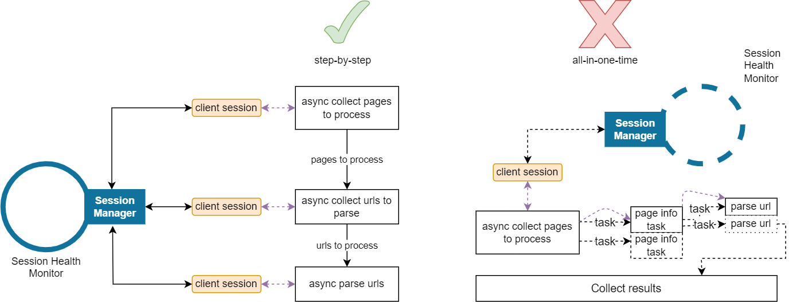

# Pubmed Scraping

## Clone project


```shell
git clone https://github.com/FourierMourier/async_pubmed_scraper.git
```

## Setup environment

### Using conda

#### Create env
```shell
conda create --name {env} python=3.10
```

#### Activate env
```shell
conda activate {env}
```

### Using venv

#### Create env
```shell
python -m venv venv
```

#### Activate env

windows
```shell
venv\Scripts\activate.bat
```
posix
```shell
source venv/bin/activate
```

### Install requirements
```shell
cd async_pubmed_scraper
pip install -r "requirements.txt"
```
There you go

## User agents list
**Scraping User Agents List:**
Before starting the scraping process, you'll need a list of user agents. You can download the user agents list,
for example, [here](https://seolik.ru/user-agents-list) or anywhere else you'd like.


## Run
To use it please edit copy example config file `main.example.yaml` to `main.yaml`, adjust your paths
```yaml
user_agents_list_path: path/to/your/agents_list.txt
# sets the directory path where you'll get the results from pubmed
output_dir: collected_data
```
and then you can run `main.py`

## Some implementation notes

**Optimal Implementation Approach:**
When it comes to implementation, you might be tempted to use a straightforward approach where you create 
an `asyncio.Task` for each individual task, such as checking URLs, and call these tasks as soon as you reach them. 
For instance, when processing a single page, you might create multiple tasks to process individual URLs representing 
article pages. However, using this approach, you'll be sharing the same `aiohttp.ClientSession` across all tasks, 
and any server error could potentially disrupt the page-wise pipeline:



**Alternative Approach for Enhanced Clarity:**
Alternatively, you can wait for all tasks corresponding to a specific real task (e.g., collecting all pages to process) 
before moving on to the next step (collecting all URLs to be parsed). In this scenario, the client session object will 
be associated with the same group of tasks and won't be nested within other tasks, leading to a clearer process flow.

By the way, 
1) without the control of concurrency using asyncio.Semaphore it's too likely for you to get banned by pubmed.
2) asyncio.Lock object for the safe session reopening
3) some pages indeed do NOT have abstract content so you might see smth like 
   "...doesn't have abstract-content selected!" in the terminal

